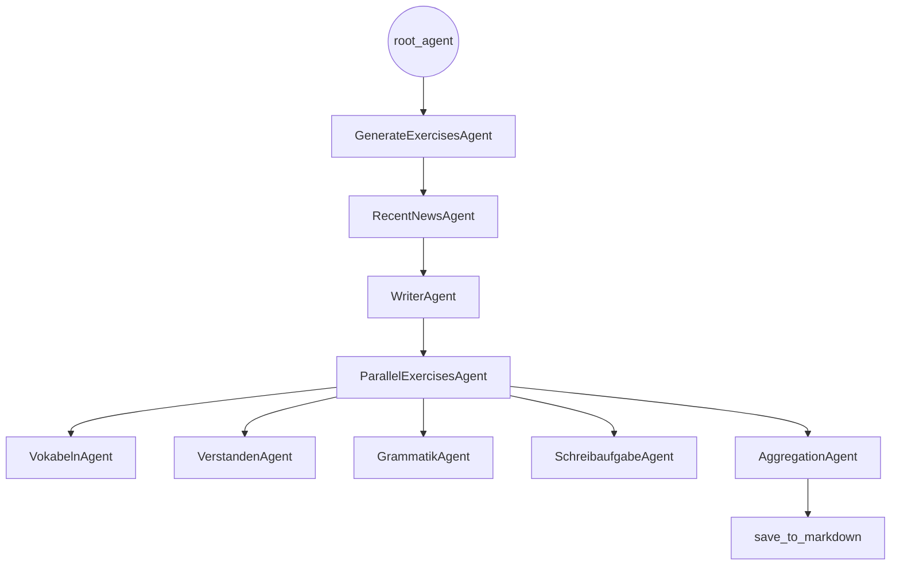

# Project Overview – German Learning Exercise Generator

This document provides a complete overview of the **German Learning Exercise Generator**, a multi-agent system built using the **Google Agent Development Kit (ADK)**. The project automates the creation of German learning materials based on **recent news from Germany**, generating a full set of pedagogical exercises including vocabulary, reading comprehension, grammar explanations, and writing prompts.

---

## 🧩 Problem Statement

Language learners often struggle to find **current, level-appropriate, and engaging materials** for study. Traditional resources lack real-time relevance, and teachers or learners must manually:

* Search for suitable news articles
* Adapt them for intermediate-level learners
* Identify vocabulary worth studying
* Create comprehension questions
* Extract grammar explanations
* Develop writing prompts

This process is time-consuming, repetitive, and difficult to sustain.

---

## 💡 Solution Statement

This project introduces a **multi-agent system** that automates the entire process of generating German learning exercises. Using the Google ADK, the system:

* Retrieves a recent German news article via Google Search
* Rewrites it into a B1/B2-friendly text
* Produces pedagogical tasks in parallel (vocabulary, grammar, comprehension, writing)
* Aggregates all content into a structured Markdown lesson
* Saves the final file automatically for the user

The result: a **fast, scalable, and pedagogically sound** pipeline for language learning content.

---

## 🏗️ Architecture

The system is built around a highly modular multi-agent workflow. Each agent performs a specialized role, allowing for clean separation of responsibilities. The architecture combines **sequential orchestration**, **parallel execution**, and **tool-based aggregation**.

### High-Level Architecture Diagram

---

## 🔧 Core Agents

Below is an overview of the major agents and their contributions.

### **1. RecentNewsAgent**

A specialized agent that retrieves a **recent, relevant news article** from Germany using the `google_search` tool. Outputs the raw news text.

### **2. WriterAgent**

Turns the news article into a **five-paragraph B1/B2-level learning text**, suitable for intermediate German learners.

### **3. Parallel Pedagogical Agents** *(via ParallelAgent)*

These agents enrich the text with learning tasks:

* **VokabelnAgent** – extracts 5 useful vocabulary items with definitions and translations.
* **VerstandenAgent** – creates 3 comprehension questions.
* **GrammatikAgent** – identifies and explains one grammar rule, citing an example.
* **SchreibaufgabeAgent** – generates a writing prompt (approx. 100 words).

### **4. AggregationAgent**

Calls the `aggregate_exercises` tool to combine all outputs into a cohesive Markdown lesson.

---

## 🛠️ Tools

### **google_search**

Used exclusively by RecentNewsAgent to retrieve up-to-date German news.

### **aggregate_exercises**

Aggregates text, vocabulary, questions, grammar, and writing tasks into Markdown.

### **save_to_markdown**

Saves the final, aggregated lesson as a `.md` file.

---

## 🎯 Workflow Summary

1. User requests a lesson.
2. `root_agent` triggers the full pipeline.
3. RecentNewsAgent fetches news.
4. WriterAgent creates level-appropriate text.
5. Four pedagogical agents generate exercises in parallel.
6. AggregationAgent assembles everything.
7. The lesson is saved as a `.md` file.
8. The user receives a confirmation.

---

## 🌟 Conclusion

This project demonstrates the power of **multi-agent systems** in educational content creation. By dividing the workflow among specialized agents, the system achieves:

* Modularity
* Clear task delegation
* High-quality language-learning output
* Scalability for future enhancements

It is an excellent example of how the Google ADK can be applied to automate complex pedagogical pipelines.

---

## 📈 Value Statement

This system significantly reduces the time required to prepare dynamic German lessons. Teachers benefit from instant, structured materials; learners enjoy engaging, current content tailored to their level.

With additional time, future improvements could include:

* A trending-topic discovery agent
* Adjustable reading levels (A2 → C1)
* Enhanced grammar analysis
* Integration with MCP servers for richer news sources

---
