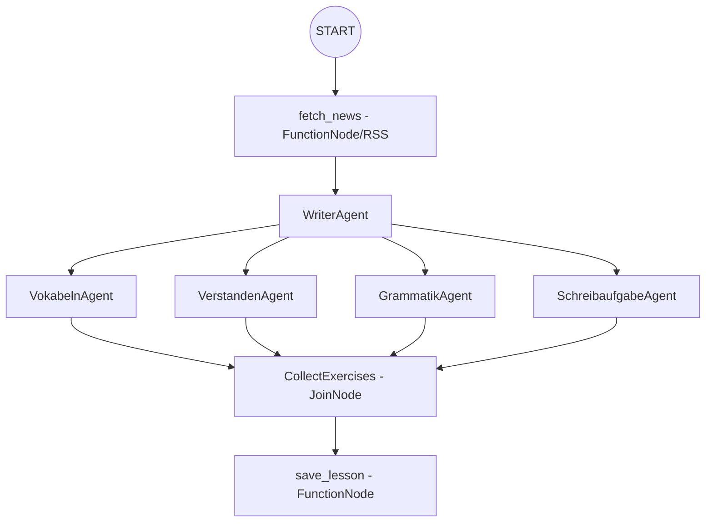

# Project Overview – German Learning Exercise Generator

This document provides a complete overview of the **German Learning Exercise Generator**, a multi-agent system built using the **Google Agent Development Kit (ADK) 2.1**. The project automates the creation of German learning materials based on **recent news from Germany**, generating a full set of pedagogical exercises including vocabulary, reading comprehension, grammar explanations, and writing prompts.

> **ADK 2.1:** The pipeline is implemented as a graph-based [`Workflow`](https://adk.dev/2.0/) (the model introduced in ADK 2.0/2.1), replacing the deprecated `SequentialAgent` / `ParallelAgent` orchestration. It can run against **Gemini** or against your **local models via LM Studio** — see [Running the project](#-running-the-project).
>
> News comes from a real German RSS feed (Tagesschau by default), so every lesson links to the **original article** and works on any provider — no Google grounding required.

---

## 🧩 Problem Statement

Language learners often struggle to find **current, level-appropriate, and engaging materials** for study. Traditional resources lack real-time relevance, and teachers or learners must manually:

* Search for suitable news articles
* Adapt them for intermediate-level learners
* Identify vocabulary worth studying
* Create comprehension questions
* Extract grammar explanations
* Develop writing prompts

This process is time-consuming, repetitive, and difficult to sustain.

---

## 💡 Solution Statement

This project introduces a **multi-agent system** that automates the entire process of generating German learning exercises. Using the Google ADK, the system:

* Retrieves a recent German news article via Google Search
* Rewrites it into a B1/B2-friendly text
* Produces pedagogical tasks in parallel (vocabulary, grammar, comprehension, writing)
* Aggregates all content into a structured Markdown lesson
* Saves the final file automatically for the user

The result: a **fast, scalable, and pedagogically sound** pipeline for language learning content.

---

## 🏗️ Architecture

The system is built as a single graph-based **`Workflow`** (`root_agent`). Each node performs a specialized role, allowing for clean separation of responsibilities. The graph combines a **sequential warm-up**, **parallel fan-out**, and a **join + save** fan-in. Each LLM node writes its result to shared workflow state via `output_key`, and downstream nodes read it back through `{state_key}` template injection.

### High-Level Architecture Diagram


```mermaid
flowchart TD
    START((START))
    FN[fetch_news - FunctionNode/RSS]
    WR[WriterAgent]
    VA[VokabelnAgent]
    UA[VerstandenAgent]
    GA[GrammatikAgent]
    SA[SchreibaufgabeAgent]
    JOIN[CollectExercises - JoinNode]
    SAVE[save_lesson - FunctionNode]

    START --> FN --> WR
    WR --> VA --> JOIN
    WR --> UA --> JOIN
    WR --> GA --> JOIN
    WR --> SA --> JOIN
    JOIN --> SAVE
```

`fetch_news` pulls a real article from an RSS feed and writes `recent_news`, `news_title`, and `news_url` to state. The `CollectExercises` **`JoinNode`** waits for **all four** parallel agents before the lesson is saved — without it, the save step would fire once per incoming edge. `save_lesson` aggregates the shared state into Markdown, adds the **source link** under the title, and writes the `.md` file.

---

## 🔧 Core Agents

Below is an overview of the major agents and their contributions.

### **1. fetch_news** *(FunctionNode — not an LLM)*

Fetches a **real, recent article** from a German news RSS feed (Tagesschau by default), optionally matching a requested topic, and writes `recent_news` (headline + teaser), `news_title`, and `news_url` to state. Because it's a plain HTTP fetch, it works identically on Gemini and LM Studio.

### **2. WriterAgent**

Expands the real article into a **five-paragraph B1/B2-level learning text**, suitable for intermediate German learners. → `base_text`.

### **3. Parallel Pedagogical Agents** *(fan-out from WriterAgent)*

These four nodes run concurrently, each reading `{base_text}` from state:

* **VokabelnAgent** – extracts 5 useful vocabulary items with definitions and translations. → `vokabeln`
* **VerstandenAgent** – creates 3 comprehension questions. → `understanding_questions`
* **GrammatikAgent** – identifies and explains one grammar rule, citing an example. → `grammer_rule`
* **SchreibaufgabeAgent** – generates a writing prompt (approx. 100 words). → `writing_assignment`

### **4. CollectExercises (JoinNode) + save_lesson**

`CollectExercises` is a `JoinNode` that waits for all four parallel agents to finish, then triggers the terminal `save_lesson` function node.

---

## 🛠️ Tools & Nodes

### **fetch_news** *(RSS FunctionNode)*

Fetches and parses a German news RSS feed (`NEWS_RSS_URL`, default Tagesschau) with the Python standard library — no extra dependency, no provider-specific grounding. Filters out video/livestream stubs, optionally matches a topic, and stores the chosen article (text + headline + URL) in workflow state.

### **save_lesson** *(state-bound FunctionNode)*

Aggregates `base_text`, `vokabeln`, `understanding_questions`, `grammer_rule`, and `writing_assignment` straight from workflow state (parameters are bound by name), adds the original-article link under the title, renders the Markdown lesson, and saves it as `german_lesson_<timestamp>.md`.

---

## 🚀 Running the project

Install dependencies (Python ≥ 3.13):

```powershell
uv sync
```

### Option A — Gemini (default)

```powershell
$env:GOOGLE_API_KEY = "<your-key>"      # or configure Vertex AI
uv run python scripts/run_lesson.py
```

### Option B — Local models via LM Studio

Start LM Studio, load a model, and enable its local server (defaults to `http://localhost:1234/v1`). Then:

```powershell
$env:MODEL_PROVIDER   = "lmstudio"
$env:LM_STUDIO_MODEL  = "qwen/qwen3.6-27b"   # the model id shown in LM Studio
# optional: $env:LM_STUDIO_API_BASE = "http://localhost:1234/v1"
uv run python scripts/run_lesson.py
```

Generate several at once, steer the topic, or set the level from the CLI:

```powershell
uv run python scripts/run_lesson.py --count 3
uv run python scripts/run_lesson.py --topic "Fußball in Deutschland"
uv run python scripts/run_lesson.py --level A2 --topic "Umwelt"
```

You can also launch the generic ADK UI / CLI on either provider:

```powershell
uv run adk web        # generic agent chat UI
uv run adk run german_teacher   # terminal
```

| Env var | Default | Purpose |
| --- | --- | --- |
| `MODEL_PROVIDER` | `gemini` | `gemini` or `lmstudio` |
| `GEMINI_MODEL` | `gemini-3.1-flash-lite` | Gemini model id |
| `LM_STUDIO_MODEL` | `google/gemma-4-26b-a4b` | LM Studio model id |
| `LM_STUDIO_API_BASE` | `http://localhost:1234/v1` | LM Studio server URL |
| `LM_STUDIO_API_KEY` | `lm-studio` | placeholder; LM Studio ignores it |
| `NEWS_RSS_URL` | Tagesschau RSS | German news feed to source articles from |
| `LESSON_LEVEL` | `B1/B2` | default CEFR level (`A1`…`C2`) |

> **Tip:** point `NEWS_RSS_URL` at any RSS 2.0 feed (e.g. a Tagesschau category feed) to change the news topic mix. The news fetch needs internet access; if the feed is unreachable the run still completes with a generic seed and no source link.

---

## 🖥️ Web UI — German Lesson Studio

A built-in web app to **read** past lessons, **generate** new ones from live news, and **adjust the CEFR level** — all from the browser.

```powershell
$env:MODEL_PROVIDER  = "lmstudio"   # or use Gemini with GOOGLE_API_KEY
uv run python scripts/ui.py
# open http://localhost:8000
```

- **Read** — every generated `german_lesson_*.md` is listed (newest first, tagged with its level) and rendered as Markdown, with the original-article link clickable.
- **Generate** — pick a **Topic**, **Level** (`A1`–`C2`), and **News feed** (Tagesschau categories), then click *Generate lesson*. The full graph runs (~20–40s) and the new lesson appears immediately.
- **Adjust level** — the chosen level flows through workflow state into every node, so the text, vocabulary, questions, grammar and writing task all scale (e.g. A2 → short, simple sentences; C1 → complex structures).
- **Same news, different level** — open any lesson and use the *“Same news — switch to …”* bar to regenerate **the exact same article** at another level. The source article is pinned (each lesson embeds its seed in a hidden `lesson-meta` comment), so `fetch_news` reuses it instead of picking a new story.

Endpoints (if you want to script it): `GET /api/lessons`, `GET /api/lessons/{name}`, `GET /api/config`, and `POST /api/generate` — `{topic, level, feed}` for a fresh article, or `{level, recent_news, news_title, news_url}` to re-level a pinned one.

---

## 🎯 Workflow Summary

1. User requests a lesson (an optional topic in the message steers article choice).
2. The `root_agent` `Workflow` seeds the graph from `START`.
3. `fetch_news` pulls a real RSS article (`recent_news`, `news_title`, `news_url`).
4. WriterAgent expands it into level-appropriate text (`base_text`).
5. Four pedagogical agents generate exercises in parallel.
6. `CollectExercises` (JoinNode) waits for all four to finish.
7. `save_lesson` aggregates state into Markdown, links the source article, and writes the `.md` file.
8. The confirmation + lesson is returned as the workflow output.

---

## 🌟 Conclusion

This project demonstrates the power of **multi-agent systems** in educational content creation. By dividing the workflow among specialized agents, the system achieves:

* Modularity
* Clear task delegation
* High-quality language-learning output
* Scalability for future enhancements

It is an excellent example of how the Google ADK can be applied to automate complex pedagogical pipelines.

---

## 📈 Value Statement

This system significantly reduces the time required to prepare dynamic German lessons. Teachers benefit from instant, structured materials; learners enjoy engaging, current content tailored to their level.

With additional time, future improvements could include:

* A trending-topic discovery agent
* Adjustable reading levels (A2 → C1)
* Enhanced grammar analysis
* Multiple configurable news feeds and per-category topic routing
* Integration with MCP servers for richer news sources

---
